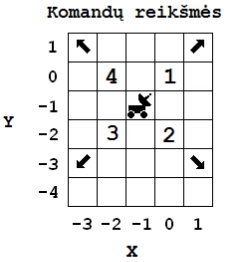

Mėnuleigis
==========

.. default-role:: math

Mėnuleigiui, matomam žemėlapio langelyje, kurio koordinatės `(x_0, y_0)`,
siunčiamos judėjimo komandų sekos.

Vykdydamas bet kurią komandą, mėnuleigis pervažiuoja į gretimą langelį nurodyta
kryptimi (komandų reikšmės pavaizduotos paveiksle).

Mėnuleigis vykdo komandų sekas, pradėdamas jas visada iš to paties langelio
`(x_0, y_0)`. Seka stabdoma tada, kai mėnuleigis sugrįžta į pradinį langelį,
kurio koordinatės `(x_0, y_0)`, arba įvykdo visas sekos komandas.

**Parašykite programą**, kuri, patikrinusi kiekvieną komandų seką, nustatytų:

- sekos stabdymo priežastį,

- įvykdytas komandas ir jų skaičių,

- kuriame langelyje mėnuleigis baigė vykdyti komandas, jei negrįžo į pradinį
  langelį.

**Pradiniai duomenys**

Duomenys yra tekstiniame faile ``U2.txt``:

- pirmoje eilutėje yra mėnuleigio pradžios langelio koordinatės `(x_0, y_0),
  -100 < x_0 < 100, -100 < y_0 < 100`,

- antroje eilutėje – komandų sekų skaičius `n\ (1 \leq n \leq 10)`,

- kitose `n` eilučių yra šie duomenys, atskirti tarpo simboliais:

  * sekos ilgis `k\ (1 \leq k \leq 30)`,

  * `k` komandų, užkoduotų skaičiais nuo 1 iki 4.
    
**Rezultatai**

Tekstiniame faile ``U2rez.txt`` įrašykite šiuos duomenis, skirdami vieną eilutę
kiekvienai komandų sekai (duomenys turi būti išvedami ta pačia tvarka, kuria
sekos pateiktos pradinių duomenų faile):

- sekos stabdymo priežastis, kuriai skiriama 20 pozicijų, t. y. viena iš šių
  priežasčių: 

  | ``pasiektas tikslas`` – sugrįžus į pradinį langelį, 
  | ``sekos pabaiga`` – įvykdžius visas sekos komandas, bet nepasiekus pradinio
    langelio,

- mėnuleigio įvykdytų komandų, atskirtų tarpais, seka ir tarpo simbolis,

- kiek komandų įvykdyta,

- jei mėnuleigis nesugrįžo į pradinį langelį – tarpo simbolis ir langelio,
  kuriame baigė vykdyti komandų seką, koordinatės.

**Nurodymai**

- Programoje naudokite įrašo duomenų tipą vienos komandų sekos vykdymo
  rezultatams saugoti.

- Programoje naudokite masyvo duomenų tipą įvykdytų komandų sekoms saugoti.

- Programoje nenaudokite sakinių, skirtų darbui su ekranu.

**Duomenų ir rezultatų pavyzdys**

``U2.txt``::

  1 1
  3
  9 1 4 1 2  3 2 3 4 1
  1 1
  3 2 3 2

``U2rez.txt``::

  pasiektas tikslas    1 4 1 2 3 2 3 4 8
  sekos pabaiga        1 1 2 2
  sekos pabaiga        2 3 2 3 2 -2

Šaltinis
--------

http://nec.lt/failai/4914_2014-IT-1_uzd-PK.pdf
