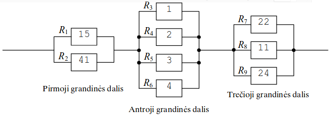

Elektros grandinės varžos skaičiavimas
======================================

.. default-role:: math

Iš fizikos kurso žinome, kad lygiagrečiai sujungtų laidininkų bendra varža
skaičiuojama pagal formulę `\frac{1}{R} = \frac{1}{R_1} + \frac{1}{R_2} +
\ldots + \frac{1}{R_n}`; čia  `R` – lygiagrečiai sujungtų laidininkų varža,
`R_1, R_2, \ldots, R_n` – atskirų laidininkų varžos. 

Nuosekliai sujungtų laidininkų bendra varža skaičiuojama pagal formulę `R = R_1
+ R_2 + \ldots + R_n`; čia `R` – nuosekliai sujungtų laidininkų bendra varža,
`R_1, R_2, \ldots, R_n` – atskirų laidininkų varžos. 

**Parašykite programą**, kuri apskaičiuotų grandinės bendrą varžą, kai grandinę
sudaro viena ar daugiau nuosekliai sujungtų grandinės dalių; kiekviena
grandinės  dalis sudaryta iš dviejų ar daugiau lygiagrečiai sujungtų žinomos
varžos laidininkų.

**Duomenys**

Programa turi skaityti duomenis iš tekstinio ``Duom1.txt`` failo. Pirmoje failo
eilutėje įrašytas nuosekliai sujungtų grandinės dalių skaičius (ne daugiau
kaip 100). Po  to atskirose eilutėse surašyti grandinę sudarančių dalių
duomenys: lygiagrečiai sujungtų laidininkų skaičius (ne daugiau kaip 50) ir jų
varžų reikšmės. 

**Rezultatas**

Rezultatą – apskaičiuotą **grandinės bendrą varžą** – programa turi  įrašyti į
``Rez1.txt`` failą dviejų ženklų po kablelio tikslumu. 

**Pavyzdys**

``Duom1.txt``::

  3
  2 15 41
  4 1 2 3 4
  3 22 11 24

``Rez1.txt``::

  17.08

Skaičiavimas: `L_1 = \frac{1}{R_1} + \frac{1}{R_1}`; `L_2 = \frac{1}{R_3} +
\frac{1}{R_4} + \frac{1}{R_5} + \frac{1}{R_6}`; `L_3 = \frac{1}{R_7} +
\frac{1}{R_8} + \frac{1}{R_9}`; `R = \frac{1}{L_1} + \frac{1}{L_2} +
\frac{1}{L_3}` – grandinės bendra varža.
