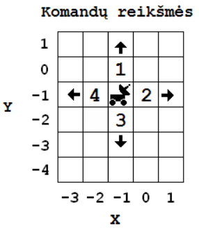

Marsaeigis
==========

.. default-role:: math

Marsaeigiui, esančiam žemėlapio langelyje, kurio koordinatės `(x_0, y_0)`,
siunčiamos judėjimo komandų sekos.

Vykdydamas bet kurią komandą, marsaeigis pervažiuoja į gretimą langelį nurodyta
kryptimi (komandų reikšmės pavaizduotos iliustracijoje).

Marsaeigis kiekvieną komandų seką pradeda vykdyti iš langelio `(x_0, y_0)`.
Sekos vykdymas stabdomas tuomet, kai marsaeigis pasiekia kelionės tikslą, kurio
koordinatės `(x_1, y_1)` arba įvykdo visas sekos komandas.

**Parašykite programą**, kuri, patikrinusi kiekvieną komandų seką, nustatytų:

- ar marsaeigis pasiekė kelionės tikslą,

- marsaeigio įvykdytų komandų seką,

- kiek komandų įvykdyta.

**Pradiniai duomenys**

Duomenys yra tekstiniame faile ``U2.txt``:

- pirmoje eilutėje yra marsaeigio pradžios langelio koordinatės `(x_0, y_0),
  -100 < x_0 < 100, -100 < y_0 < 100`,

- antroje eilutėje – kelionės tikslo koordinatės `(x_1, y_1), -100 < x_1 < 100,
  -100 < y_1 < 100`,

- trečioje eilutėje – komandų sekų skaičius `n\ (1 \leq n \leq 10)`,

- kitose `n` eilučių yra šie duomenys, atskirti vienas nuo kito tarpo
  simboliais:

  * sekos ilgis `k\ (1 \leq k \leq 30)`,

  * `k` komandų, užkoduotų skaičiais nuo 1 iki 4.
    
**Rezultatai**

Tekstiniame faile ``U2rez.txt`` įrašykite šiuos duomenis skirdami vieną eilutę
kiekvienai komandų sekai (duomenys turi būti išvedami ta pačia tvarka, kuria
sekos pateiktos pradinių duom enų faile):

- sekos stabdymo priežastį, kuriai skiriama 20 pozicijų, t. y. vieną iš šių
  pranešimų:

  | ``pasiektas tikslas`` – pasiekus kelionės tikslą,
  | ``sekos pabaiga`` – įvykdžius visas sekos komandas, bet nepasiekus kelionės
    tikslo,

- marsaeigio įvykdytas komandas, atskirtas tarpais, ir tarpo simbolį,

- kiek komandų įvykdyta.

**Nurodymai**

- Programoje naudokite įrašo duomenų tipą vienos komandų sekos vykdymo
  rezultatams saugoti.

- Programoje naudokite masyvo duomenų tipą įvykdytų komandų sekoms saugoti.

- Programoje nenaudokit e sakinių, skirtų darbui su ekranu.

**Duomenų ir rezultatų pavyzdys**

``U1.txt``::

  5 -1
  8 -3
  3
  7 2 3 2 3  1 3 2
  2 1 4
  12 2 3 2 3 2 3 2 3 2 3 2 1

``U1rez.txt``::

  pasiektas tikslas   2 3 2 3 1 3 2 7
  sekos pabaiga       1 4 2
  pasiektas tikslas   2 3 2 3 2 5

Šaltinis
--------

http://www.nec.lt/failai/4429_2014-IT-VBE.pdf
