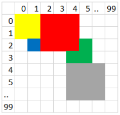
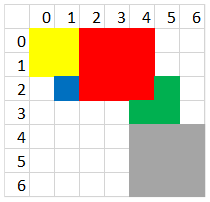
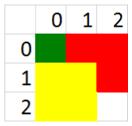

Kvardratai
==========

.. default-role:: math

Spalvotų kvadratų rinkinys aprašomas nurodant jų spalvą, viršutinio kairiojo
kampo koordinates ir kvadrato kraštinės ilgį.

Kvadratai koordinačių sistemoje gali vieni kitus dengti. Sukurkite galutinį
piešinį, gaunamą iš eilės dedant vie ną kvadratą ant kito (naujasis k vadratas
nus palvina tik dar baltus langelius).

Vaizdo dydis yra `100 \times 100` langelių (`x` ir `y` koordinatės kinta nuo 0
iki 99). Pradinis piešinys nuspalvintas baltai (RGB kodas – 255 255 255),
piešiami kvadratai balti nebūna.

**Parašykite programą**, kuri nustatytų naujojo piešinio langelių spalvas.

*Pastaba. RGB – spalvų maišymo sistema, kurioje naudojamos trys bazinės
spalvos: raudona (R), žalia (G) ir m ėlyna (B).*

**Pradiniai duomenys**

Duomenys pateikiami tekstiniame faile ``U2.txt``.

Pirmoje eilutėje esantis sveikasis skaičius `n\ (1 \leq n \leq 100)` nurodo,
kiek yra kvadratų.

Tolesnėse `n` eilučių pateikiami kvadratų duomenys:

- pirmi du skaičiai – viršutinio kairiojo kampo koordinatės `x, y\ (0 \leq x
  \leq 99` ir `0 \leq y \leq 99)`;

- vienas skaičius – kvadrat o kraštinės ilgis `a\ (1 \leq a  \leq 20, x+a \leq
  100, y +a \leq 100)`;

- trys skaičiai, nusakantys kvadrato spalvos RGB komponentes.

**Rezultatai**

Rezultatus pateikite t ekstiniame faile ``U2rez.txt``.

Į rezultatų failą įrašykite ne visą piešinį, o tik iki paskutinių nuspalvintų
stulpelių ir eilučių (atmeskite baltus stulpelius iš dešinės ir baltas eilutes
iš apačios).

Rezultatų faile turi būti įrašyta:

- pirmoje eilutėje – galutinio piešinio ilgis `a` (eilučių skaičius) ir plotis
  `b` (stulpelių skaičius);

- kitose `a \times b` eilučių, einant per piešinio langelius iš kairės į dešinę
  ir iš viršaus į apačią, – po tris skaičius, nusakančius langelio RGB
  komponentes.

**Nurodymai**

- Sukurkite funkciją, kuri ant piešinio uždeda vieną kvadratą.

- Programoje naudokite struktūros duomenų tipą kvadratų duomenims saugoti.

- Programoje nenaudokite sakinių, skirtų darbui su ekranu.

- Programoje nenaudokite globalių pagalbinių kintamųjų.

**Duomenų ir rezultatų pavyzdys**

``U2.txt``::

  3
  0 0 1 0 128 0
  0 1 2 255 255 0
  1 0 2 255 0 0

``U2rez.txt``::

  3 3
  0 128 0
  255 0 0
  255 0 0
  255 255 0
  255 255 0
  255 0 0
  255 255 0
  255 255 0
  255 255 255

Rezultatą atitinkantis piešinys:

Šaltinis
--------

http://nec.lt/failai/7333_IT-VBE-2_2017.pdf
